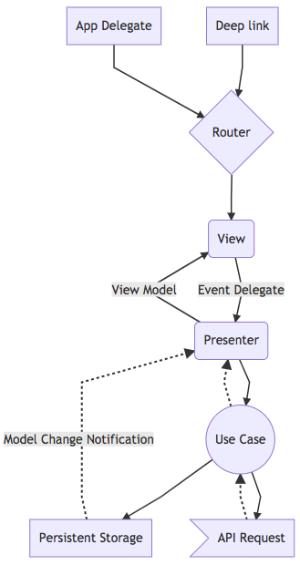

# iOS Model-View-Presenter (MVP) Architecture




## Overview

We have chosen to follow a Model-View-Presenter architecture. Each UI screen will have its own View and Presenter. The View should be thin and display data provided to it by its Presenter. Only view logic should ever be in the View layer. All business logic for a View will be encapsulated in its Presenter. The Presenter in turn will use logic and data models provided by the shared Model layer (via Use Cases and Database Store) to fulfill the data requirements and actions for the View. This separation of concerns will make unit testing easier and more predictable. 

### Router

Whether a View is requested by another view or via a deep-link, the Router will collect the needed arguments from the requester and instantiate the View with them. (The View will then create the Presenter with these same arguments.) The Router is app specific and should be the only object that instantiates Views.


### View

Because each View must be accessible via deep-linking, all data requirements for that View will be actively fetched by it's corresponding Presenter. No assumption will be made as to the data being available in cache or persistent storage. A View should be thin and dumb. Avoid overloading a View so that it has multiple "display paths", depending on the arguments passed in. For instance, the Teacher and Student apps should not share the same exact View/Presenter code.


### Presenter

The Presenter is app and View specific. It is instantiated by its owning View. It houses the business logic. It is fully testable. 

The Presenter listens for Model changes from the data store, checks for cached data, makes requests for updated and new data, and provides data to the View in a view-specific structure. This view-speicifc data structure can be a separate View Model or as properties and methods on the Presenter. The Presenter will also handle user generated actions and events, data validation, logging, and routing.

### Use Cases

Use Cases are shared amongst many presenters. Use Cases reside in the Core project. 

A Use Case represents a specific action on an entity or a collecton of entities, such as GetCourses or DeleteCourse. A Use Case encapsulates code that makes an API request and saves the response to the Database Store. 


### Model

There are several types of models within this architecture. The API-level model, prefixed with API, represents the the data that comes from the Canvas API.

A typical API model looks something like this:

```
// https://canvas.instructure.com/doc/api/groups.html#Group
public struct APIGroup: Codable, Equatable {
    let id: String
    let name: String
    let description: String?
    let is_public: Bool
    let followed_by_user: Bool
    let join_level: JoinLevel
    let members_count: Int
    let avatar_url: String?
    let context_type: String
    let course_id: String?
    let role: String?
    let group_category_id: String
    let sis_group_id: String?
    let sis_import_id: String?
    let storage_quota_mb: String
    let permissions: Permissions?

    struct Permissions: Codable, Equatable {
        let create_announcement: Bool
        let create_discussion_topic: Bool
    }
}
```

API models must:

- Have an opening comment line with the endpoint documentation URL
- Be a swift struct
- Conform to Codable
- Have property names that match exactly what the API returns
- Be completely covered by unit tests