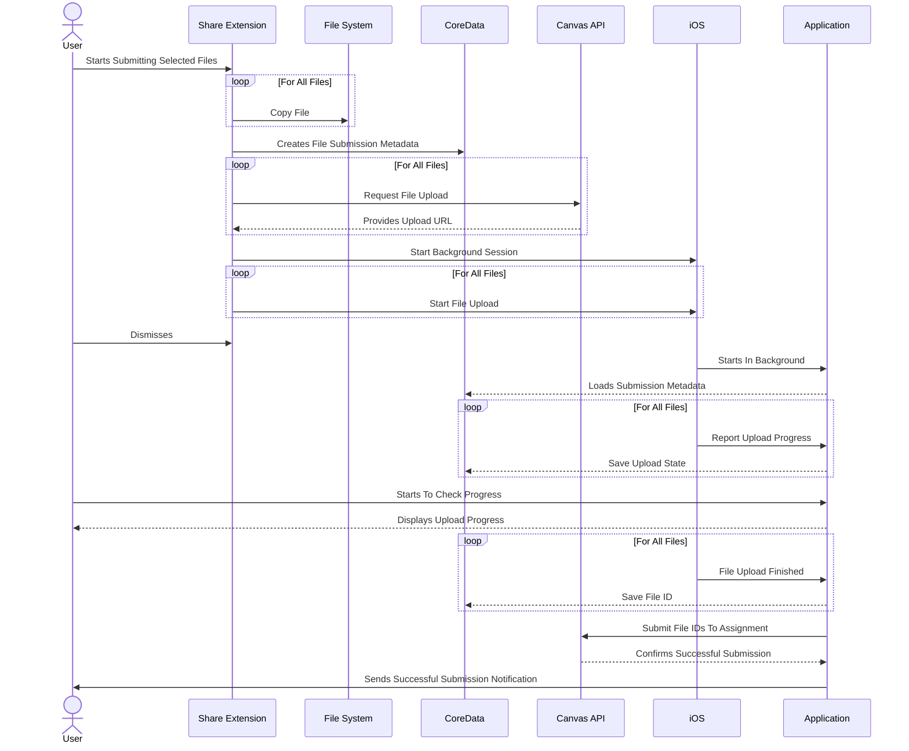

# File Submission Technical Overview
## Submission Sequence
The following sequence diagram illustrates interactions between various parts of the system during a file upload submission originating from the file share extension of the Student app.

