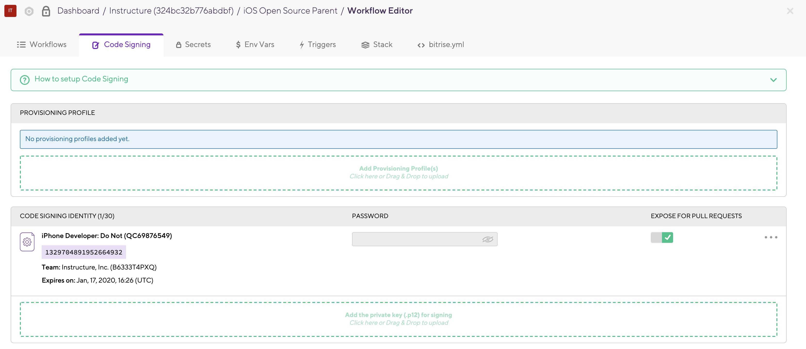
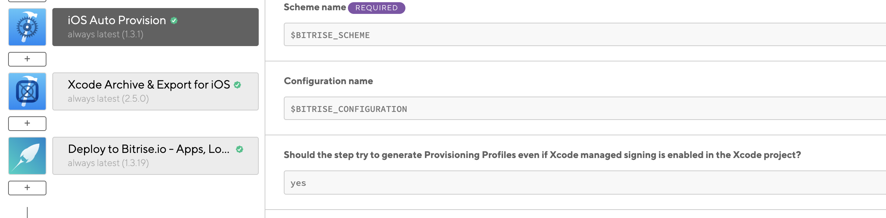
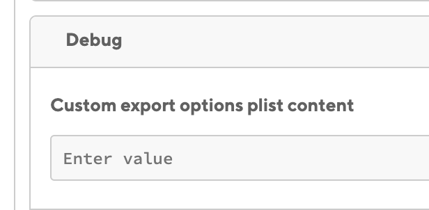
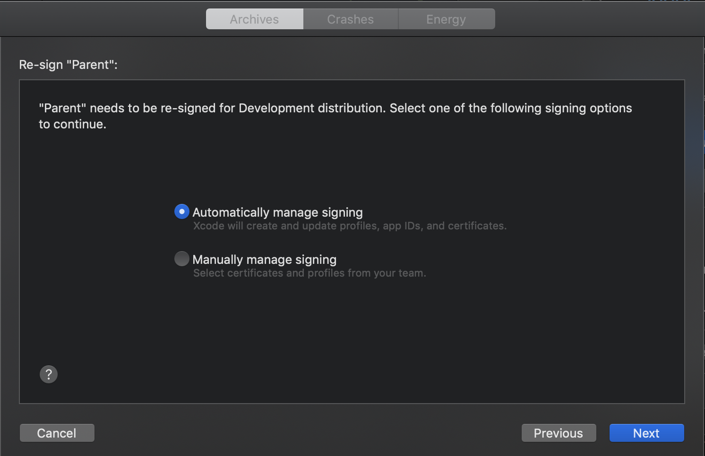
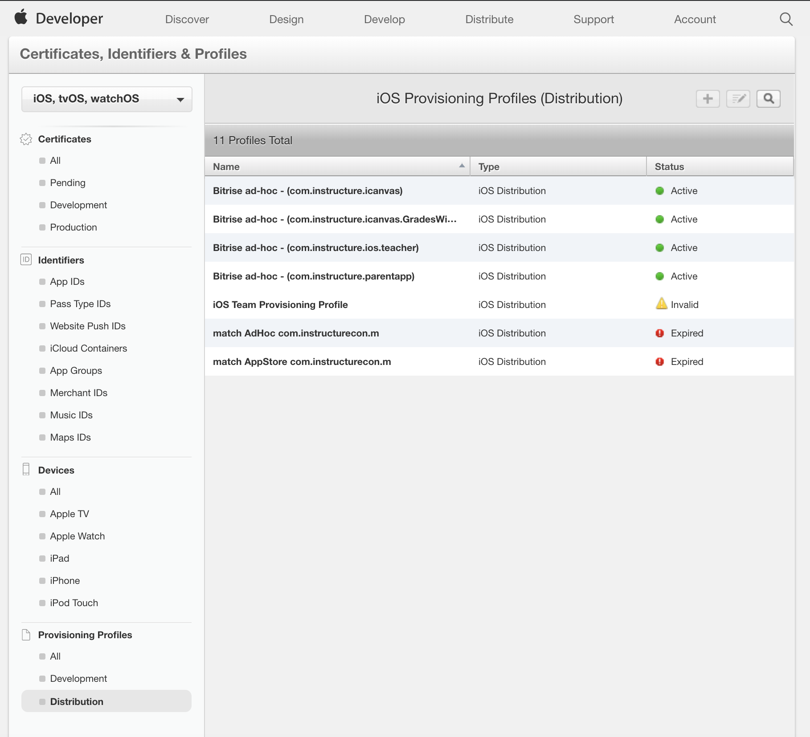

# iOS Code Signing on Bitrise

#### Code Signing

- Check the `Code Signing` tab in the Workflow editor
  - There should be no provisioning profiles
    - If provisioning profiles exist, delete them
  - Code signing identity should be present and not expired
    - If there's no code signing identity & you can export locally, run `codesigndoc` to upload the identity to bitrise
    - If you can't export locally, download the identity from the apple dev portal



#### Steps

- `iOS Auto Provision` step must have `Should the step try to generate Provisioning Profiles even if Xcode managed signing is enabled in the Xcode project?` set to `Yes`



- `Xcode Archive & Export for iOS` step must have an empty value for `Custom export options plist content`



#### Errors

```
Error:
Failed to find development Xcode managed provisioning profile for bundle id: com.instructure.parentapp.
Please open your project in your local Xcode and generate and ipa file
with the desired distribution type and by using Xcode managed codesigning.
This will create / refresh the desired managed profiles.
```

Locally build the app for archiving and then export (`Window` -> `Organizer` -> `Distribute App`) with `Automatically manage signing` to refresh the profiles.



```
generate_profiles set to true, but failed to generate Provisioning Profiles with error:
Apple provided the following error info: There were errors in the data supplied. Please correct and re-submit. Multiple profiles found with the name 'Bitrise ad-hoc - (com.instructure.parentapp)'.  Please remove the duplicate profiles and try again.
```

Visit the [Apple dev portal](http://developer.apple.com/), click on `Account`, then `Certificates, IDs & Profiles`, and finally select `Distribution` under `Provisioning Profiles`. Delete the Bitrsie profile related to the failing build.


